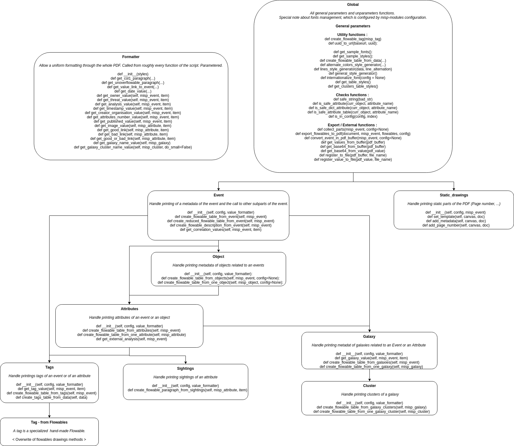
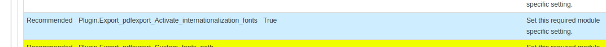
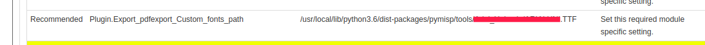

## Overview 

A big overview of the exportpdf tool is available at : 

## Parameters
### Dynamic links
You can specify your MISP URL to allow the PDF generator to create links from the PDF to your MISP instance events.
The parameter to specify is "base_url_for_dynamic_link". Leave blank if you don't want the PDF generator to generate URL.
### Name
You can specify your organisation name, to be added to the PDF metadata.
The parameter to specify is "name_for_metadata". Leave blank if you don't want the PDF generator to add this name to the metadata.
### Textual description
You can specify if you want a textual description of the event to be prepend to the generated PDF.
The parameter to specify is "textual_description". Leave blank if you don't want the PDF generator to prepend this text description.
### Galaxy description
You can specify if you want related galaxies to be added to the PDF.
The parameter to specify is "galaxy_description". Leave blank if you don't want the PDF generator to add galaxies description.
### Related events
You can specify if you want related events to be added to the PDF. Be aware this option might leads to information leaks if you have confidential events in your MISP instance.
The parameter to specify is "related_events". Leave blank if you don't want the PDF generator to add related events..

Example of parameters all activated.

## International fonts
If text of exported events does not show up in the final PDF, Fonts may be the source of the problem.
For that, you can activate a international font, which handle CJK characters, named "Noto".

Due to their size, fonts are not bundled with PyMISP. You can download them, by following next steps : 

Manual fonts install on a MISP instance, connected in SSH :
> cd /usr/local/lib/python3.6/dist-packages/pymisp/tools/
> git clone https://github.com/MISP/pdf_fonts

Then you can activate the option by filling the following parameter : 

Leave blank if you don't want to use internationalization fonts.

If "Noto" is not fine for you (e.g. you want to use Arial Unicode[,](https://github.com/Vincent-CIRCL/Arial_Unicode) etc.) you can give as a parameter the font to use. Be sure the font is only contained in one TTF. 

Fill this parameter, with the font's TTF's absolute path, as follow : 

Note that if you give a custom fonts, bold/italic/special styles won't be used in the final PDF.
Leave blank if you don't want to use your custom font.
